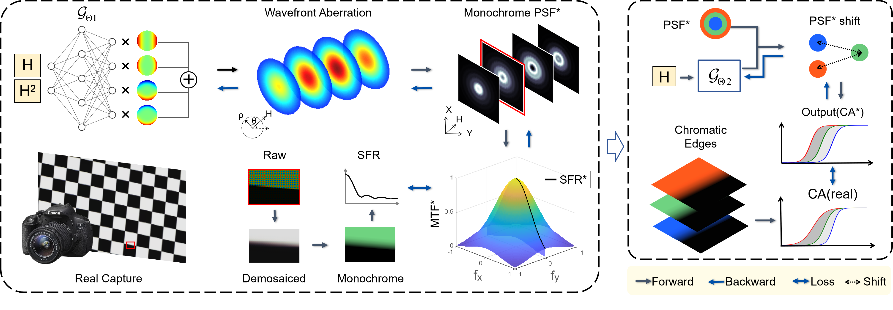
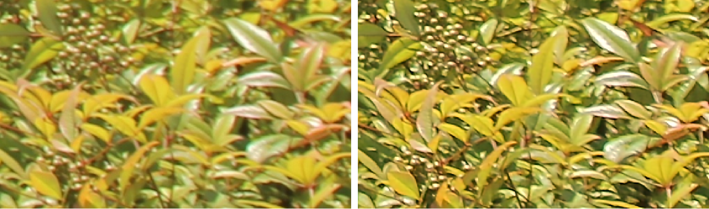

# PSF Estimation
**This repo contains the official implementation for Paper "A Physics-Informed Blur Learning Framework for Imaging Systems".**

### [Project Page](https://openimaginglab.github.io/PSF-Estimation/) | [Paper](https://arxiv.org/abs/2502.04719) 

Liqun Chen, Yuxuan Li, Jun Dai, Jinwei Gu, Tianfan Xue  
arXiv 2025   

We introduce a two-step point spread function (PSF) estimation framework. The first step is dedicated to learning spatially variant monochromatic aberration by aligning with the measured spatial frequency response curves. The second step focuses on learning PSF shifts across channels, utilizing the measured chromatic area difference data.

Performance comparison with state-of-the-art methods on real captures.

Deblurring results for an outdoor scene captured with a Canon EOS600D camera.

Deblurring results for a defocused scene captured with a Canon EOS 600D at a focal length of 55mm, with a focal distance of 1m and an object distance of 5m, along with the deblurred output (on the right).

